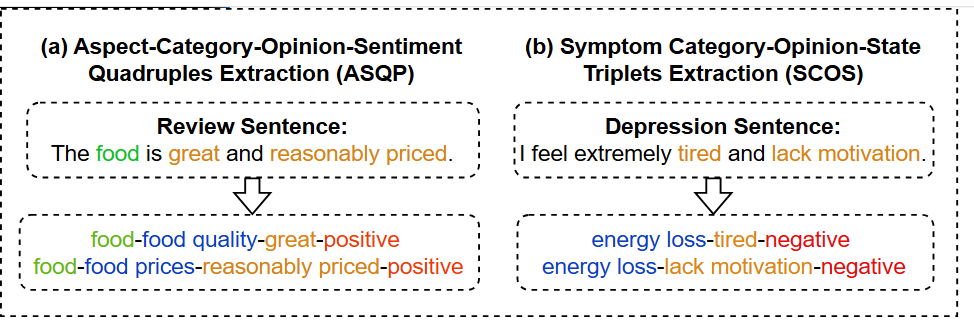
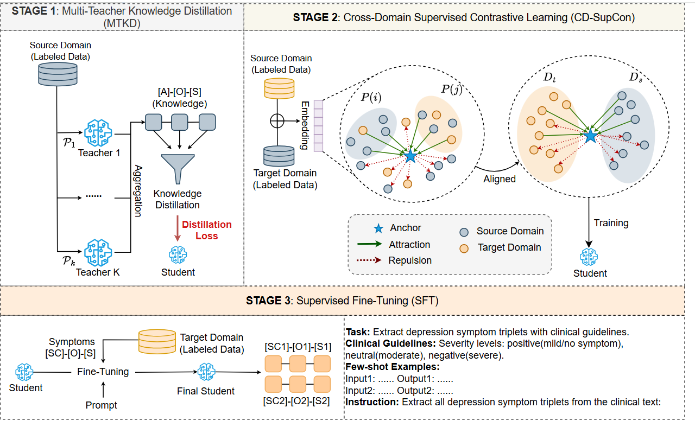

# PDA

This repo contains the data and code for our paper "Progressive Domain Adaptation for Fine-Grained Depression Symptom Extraction"(PDA) in ECML~PKDD 2026.

## Abstract
Depression is a complex mental disorder, and early identification is crucial for effective intervention. Existing approaches largely rely on coarse-grained sentiment classification, which fails to capture fine-grained symptom expressions and their semantic structure, limiting interpretability. Inspired by Aspect Sentiment Quadruple Prediction (ASQP), we observe that depressive symptoms exhibit a structured pattern analogous to _aspect–opinion–sentiment_ modeling. We therefore reformulate ASQP by retaining the _category–opinion–sentiment_ (COS) representation, thereby enabling structured extraction of depressive symptom triplets. To facilitate cross-domain transfer, we propose a progressive domain adaptation framework. It first employs multi-teacher knowledge distillation to learn domain-general extraction capabilities, then introduces cross-domain contrastive learning to align semantic representations, and finally performs target-domain fine-tuning to adapt to depression-specific linguistic characteristics. Experiments on Twitter and Reddit datasets demonstrate that our approach achieves more than 5\% absolute improvement over competitive baselines, offering a more interpretable and robust solution for depression detection.

**Keywords:** Depression Detection, Knowledge Distillation, Contrastive Learning, Aspect-based Sentiment Quadruple Prediction, Domain Adaptation

## Code Link
https://github.com/Jeoland/PDA

## Task Definition

The ASQP task extracts sentiment quadruples consisting of aspect terms, aspect categories, opinion terms, and sentiment polarity. As shown in **Fig (a)**, for the review _**"the food is great and reasonably priced"**_, ASQP identifies _**{(food, food quality, great, positive),(food, food prices, reasonably priced, positive)}**_. To align with our task setting, we retain only the category-opinion-sentiment components. Meanwhile, we observe that depressive texts exhibit a similar structural pattern grounded in clinical symptom definitions such as PHQ-9 and ReDSMS. For example, in **Fig (b)**, the sentence _**"I feel extremely tired and lack motivation"**_ yields symptom triplets _**{(energy loss, tired, negative), (energy loss, lack motivation, negative)}**_. Here, the symptom category (**SC**) _**"energy loss"**_ functions as a categorical abstraction analogous to an aspect category; the symptom opinions (**O**) **_"tired"_** and **_"lack motivation"_** correspond to opinion terms; and the symptom state (**S**) **_"negative"_** reflects affective orientation. Based on this structural correspondence, we define the depressive symptom triplet representation as **SCOS**.

## Model Description

First, we use pseudo-labeled target-domain samples as additional training resources.We further employ a paraphrasing model4 to generate diverse samples and reduce data sparsity. Second, inspired by generative scoring methods, we design a pseudo-label optimizer (PLO) that treats pseudo-labels as conditional sequences and calculates likelihood-based match scores. Unlike confidence-based filtering, this generative approach provides fine-grained evaluation and effectively mitigates error propagation from noisy pseudo-labels.

## Requirements
本项目所涉及的Python包没有特殊要求，具体版本请读者自行解决，如果有具体问题可以联系`zouzhou0519@163.com`

## Code Sturcture
* `train2.py`：模型的主文件，包括模型的完整结构、训练和测试
* `data`：数据集文件，包括4个源域（Laptop，Rest、Rest15和Rest16）以及2个抑郁症目标域（Reddit、Twitter），原始数据集为https://github.com/Jeoland/Depression
* `t5.py`:是对比实验中t5系列模型的实验代码
* `run.ipynb`：`train2.py`的运行脚本

## Usage
直接运行**`run.ipynb`**中的脚本即可 `!python train2.py --mode kd_meta`

## Note
代码的复现有任何问题可以咨询`zouzhou0519@163.com`

